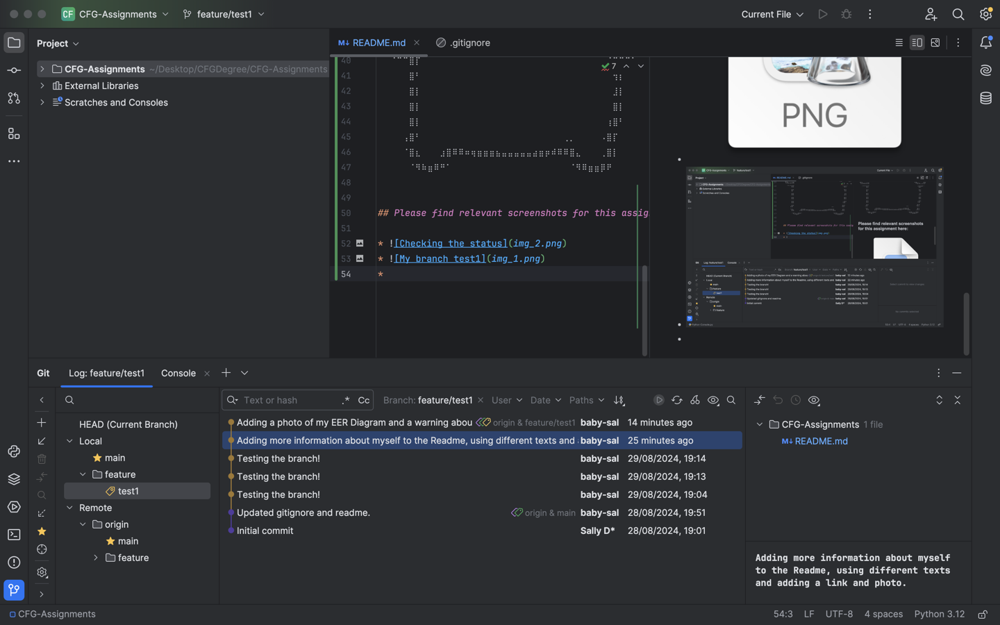

# CFG-Assignments

## I'm Sally Davies and this is my Readme 

ଘ(✿˵•́ ᴗ •̀˵)

### Please learn a little about me here. 

__Five fun facts about me:__
* I studied Chemistry at the University of Manchester
* I lived in Japan for five years
* I can speak Japanese
* I love travelling and have been to over 20 countries
* Becoming a data engineer is my passion!

I recently completed my *CFG Kickstarter* in *Data and SQL*, it was really interesting and I was able to make a
database about my favourite characters from **Sanrio**. 
You can get an idea of the database by looking at my 

You can find more information about my favourite Sanrio character [Pompompurin](https://sanrio.fandom.com/wiki/Pompompurin).
> It's easy to fall in love with Pompompurin so follow the link at your own caution!

I think that's enough about me!
⠀⠀⠀⠀⠀⠀⠀⠀⠀⠀⠀⠀⠀⠀⠀⠀⠀⠀⠀⠀⠀⠀⣀⠀⠀⠀⠀⠀⠀⠀⠀⠀⠀⠀⠀⠀⠀⠀⠀⠀⠀⠀⠀⠀
⠀⠀⠀⠀⠀⠀⠀⠀⠀⠀⠀⠀⠀⠀⠀⠀⠀⣀⣀⣤⣤⣾⣿⣷⣄⣀⣀⠀⠀⠀⠀⠀⠀⠀⠀⠀⠀⠀⠀⠀⠀⠀⠀⠀
⠀⠀⠀⠀⠀⠀⠀⠀⠀⠀⠀⠀⠀⠀⢀⣶⣿⣿⣿⣿⣿⣿⣿⣿⣿⣿⣿⣿⣶⣄⠀⠀⠀⠀⠀⠀⠀⠀⠀⠀⠀⠀⠀⠀
⠀⠀⠀⠀⠀⠀⠀⠀⠀⠀⣀⣤⣶⣾⠿⠿⣿⣿⣿⣿⣿⣿⣿⣿⣿⣿⣿⣿⣿⠿⢷⣦⣄⡀⠀⠀⠀⠀⠀⠀⠀⠀⠀⠀
⠀⠀⠀⠀⢀⣀⣤⣴⣶⠿⠛⠋⠁⠀⠀⠀⠀⠉⠉⠛⠛⠛⠛⠛⠛⠛⠛⠉⠁⠀⠀⠈⠙⠻⣷⣦⣄⡀⠀⠀⠀⠀⠀⠀
⠀⢀⣤⣾⠿⠛⠉⠁⠀⠀⠀⠀⠀⠀⠀⠀⠀⠀⠀⠀⠀⠀⠀⠀⠀⠀⠀⠀⠀⠀⠀⠀⠀⠀⠀⠉⠛⠿⣷⣤⣀⠀⠀⠀
⢠⣿⠏⠀⠀⠀⠀⠀⠀⣠⣄⠀⠀⠀⣰⣤⠀⠀⠀⠀⠀⠀⠀⠀⠀⠀⠀⠀⣀⠀⠀⠀⢀⣄⠀⠀⠀⠀⠀⠉⠻⣷⣄⠀
⣿⠇⠀⠀⠀⠀⠀⠀⣰⡿⠃⠀⠀⠀⠉⠁⠀⠀⣀⠀⠸⣶⠖⠀⠀⠀⠀⠘⠿⠁⠀⠀⢸⣿⠀⠀⠀⠀⠀⠀⠀⠘⣿⣆
⣿⡆⠀⠀⠀⠀⠀⢀⣿⠃⠀⠀⠀⠀⠀⠀⠀⠀⠿⣦⡾⠿⣦⣤⡿⠀⠀⠀⠀⠀⠀⠀⠘⣿⡄⠀⠀⠀⠀⠀⠀⠀⢸⣿
⠹⣿⣦⣀⠀⠀⠀⣸⣿⠀⠀⠀⠀⠀⠀⠀⠀⠀⠀⠀⠀⠀⠀⠀⠀⠀⠀⠀⠀⠀⠀⠀⠀⠙⢿⣦⣀⠀⠀⠀⣀⣴⣿⠃
⠀⠈⠙⠛⠛⣛⣿⣿⡏⠀⠀⠀⠀⠀⠀⠀⠀⠀⠀⠀⠀⠀⠀⠀⠀⠀⠀⠀⠀⠀⠀⠀⠀⠀⠀⠉⢻⣿⡟⠛⠛⠋⠀⠀
⠀⢀⣴⣾⠿⠛⠋⠉⠀⠀⠀⠀⠀⠀⠀⠀⠀⠀⠀⠀⠀⠀⠀⠀⠀⠀⠀⠀⠀⠀⠀⠀⠀⠀⠀⠀⠀⠙⠿⣷⣤⡀⠀⠀
⢠⣿⡏⠀⠀⠀⠀⠀⠀⠀⠀⠀⠀⠀⠀⠀⠀⠀⠀⠀⠀⠀⠀⠀⠀⠀⠀⠀⠀⠀⠀⠀⠀⠀⠀⢀⡀⠀⠀⠈⠙⣿⡄⠀
⠀⢻⣷⣤⣤⣴⣶⠀⠀⠀⠀⠀⠀⠀⠀⠀⠀⠀⠀⠀⠀⠀⠀⠀⠀⠀⠀⠀⠀⠀⠀⠀⠀⠀⠀⠘⠿⣶⣤⣀⣠⣿⠇⠀
⠀⠀⠈⠉⠉⣿⡏⠀⠀⠀⠀⠀⠀⠀⠀⠀⠀⠀⠀⠀⠀⠀⠀⠀⠀⠀⠀⠀⠀⠀⠀⠀⠀⠀⠀⠀⠀⠘⣿⡟⠋⠁⠀⠀
⠀⠀⠀⠀⠀⣿⠃⠀⠀⠀⠀⠀⠀⠀⠀⠀⠀⠀⠀⠀⠀⠀⠀⠀⠀⠀⠀⠀⠀⠀⠀⠀⠀⠀⠀⠀⠀⠀⢻⡇⠀⠀⠀⠀
⠀⠀⠀⠀⠀⣿⡇⠀⠀⠀⠀⠀⠀⠀⠀⠀⠀⠀⠀⠀⠀⠀⠀⠀⠀⠀⠀⠀⠀⠀⠀⠀⠀⠀⠀⠀⠀⠀⣸⡇⠀⠀⠀⠀
⠀⠀⠀⠀⠀⣿⡇⠀⠀⠀⠀⠀⠀⠀⠀⠀⠀⠀⠀⠀⠀⠀⠀⠀⠀⠀⠀⠀⠀⠀⠀⠀⠀⠀⠀⠀⠀⠀⣿⡇⠀⠀⠀⠀
⠀⠀⠀⠀⠀⣿⡇⠀⠀⠀⠀⠀⠀⠀⠀⠀⠀⠀⠀⠀⠀⠀⠀⠀⠀⠀⠀⠀⠀⠀⠀⠀⠀⠀⠀⠀⠀⢰⣿⠃⠀⠀⠀⠀
⠀⠀⠀⠀⢠⣿⠃⠀⠀⠀⠀⠀⠀⠀⠀⠀⠀⠀⠀⠀⠀⠀⠀⠀⠀⠀⠀⠀⠀⠀⢀⡀⠀⠀⠀⠀⠠⣿⡏⠀⠀⠀⠀⠀
⠀⠀⠀⠀⠈⣿⣆⠀⠀⠀⣰⣿⠿⠿⠶⢶⣶⣶⣶⣦⣤⣤⣤⣤⣤⣴⣶⡶⠾⠿⠿⣿⣄⠀⠀⠀⢀⣿⡇⠀⠀⠀⠀⠀
⠀⠀⠀⠀⠀⠈⠻⠷⣶⠿⠛⠁⠀⠀⠀⠀⠀⠀⠀⠀⠀⠀⠀⠀⠀⠀⠀⠀⠀⠀⠀⠈⠻⠿⣶⣶⡿⠟⠀⠀

## Please find relevant screenshots for this assignment here:

* 
* 
* 
* 