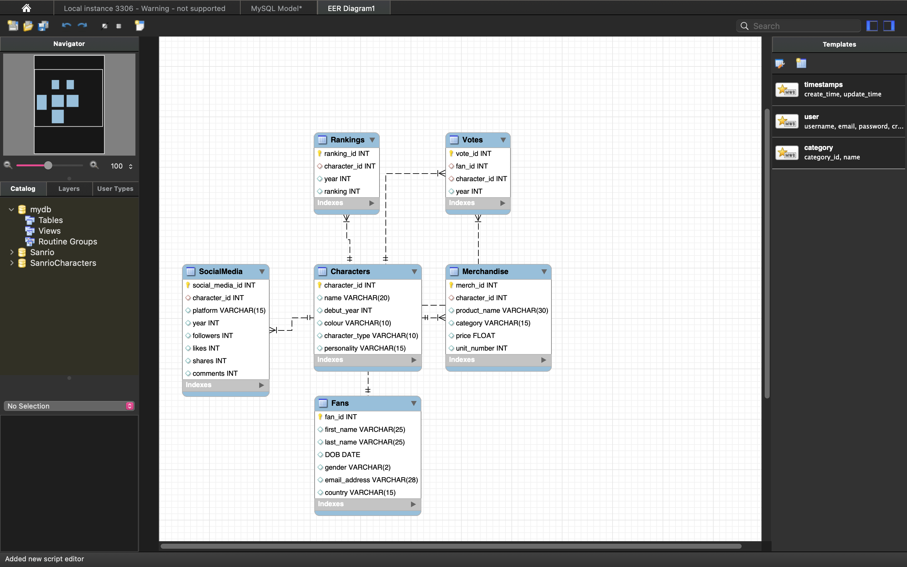
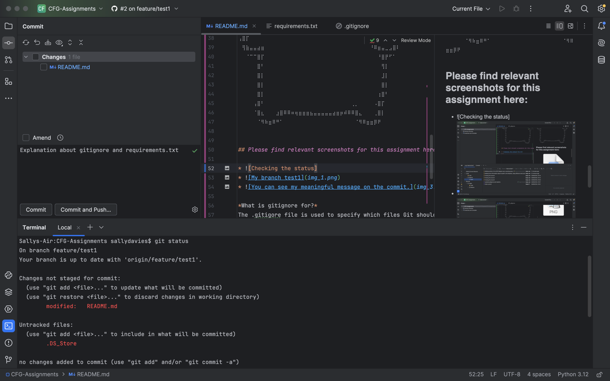
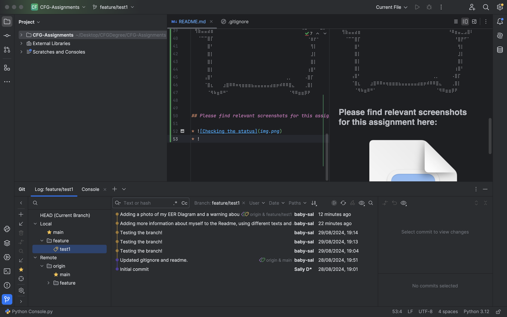
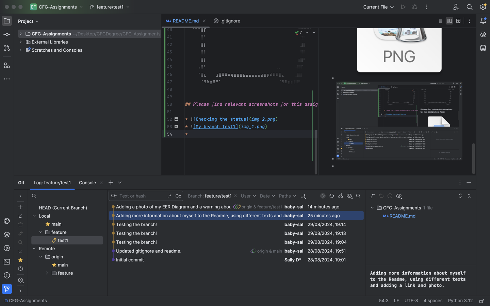
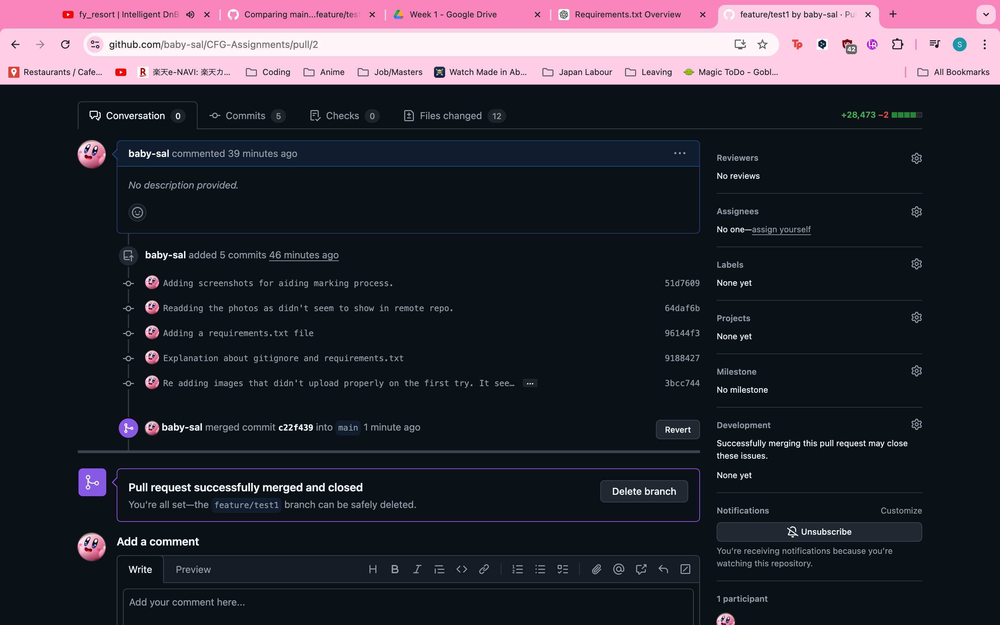
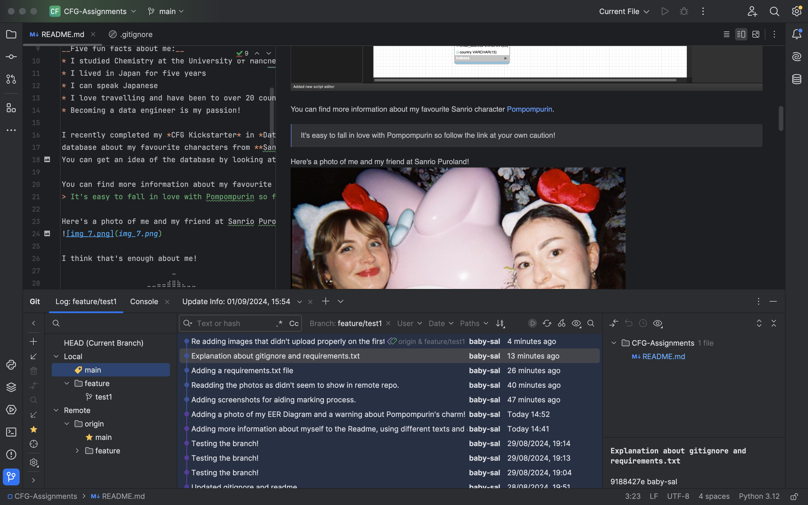

# CFG-Assignments

## I'm Sally Davies and this is my Readme 

ଘ(✿˵•́ ᴗ •̀˵)

### Please learn a little about me here. 

__Five fun facts about me:__
* I studied Chemistry at the University of Manchester
* I lived in Japan for five years
* I can speak Japanese
* I love travelling and have been to over 20 countries
* Becoming a data engineer is my passion!

I recently completed my *CFG Kickstarter* in *Data and SQL*, it was really interesting and I was able to make a
database about my favourite characters from **Sanrio**. 
You can get an idea of the database by looking at my EER Diagram: 

You can find more information about my favourite Sanrio character [Pompompurin](https://sanrio.fandom.com/wiki/Pompompurin).
> It's easy to fall in love with Pompompurin so follow the link at your own caution!

Here's a photo of me and my friend at Sanrio Puroland!

I think that's enough about me!
⠀⠀⠀⠀⠀⠀⠀⠀⠀⠀⠀⠀⠀⠀⠀⠀⠀⠀⠀⠀⠀⠀⣀⠀⠀⠀⠀⠀⠀⠀⠀⠀⠀⠀⠀⠀⠀⠀⠀⠀⠀⠀⠀⠀
⠀⠀⠀⠀⠀⠀⠀⠀⠀⠀⠀⠀⠀⠀⠀⠀⠀⣀⣀⣤⣤⣾⣿⣷⣄⣀⣀⠀⠀⠀⠀⠀⠀⠀⠀⠀⠀⠀⠀⠀⠀⠀⠀⠀
⠀⠀⠀⠀⠀⠀⠀⠀⠀⠀⠀⠀⠀⠀⢀⣶⣿⣿⣿⣿⣿⣿⣿⣿⣿⣿⣿⣿⣶⣄⠀⠀⠀⠀⠀⠀⠀⠀⠀⠀⠀⠀⠀⠀
⠀⠀⠀⠀⠀⠀⠀⠀⠀⠀⣀⣤⣶⣾⠿⠿⣿⣿⣿⣿⣿⣿⣿⣿⣿⣿⣿⣿⣿⠿⢷⣦⣄⡀⠀⠀⠀⠀⠀⠀⠀⠀⠀⠀
⠀⠀⠀⠀⢀⣀⣤⣴⣶⠿⠛⠋⠁⠀⠀⠀⠀⠉⠉⠛⠛⠛⠛⠛⠛⠛⠛⠉⠁⠀⠀⠈⠙⠻⣷⣦⣄⡀⠀⠀⠀⠀⠀⠀
⠀⢀⣤⣾⠿⠛⠉⠁⠀⠀⠀⠀⠀⠀⠀⠀⠀⠀⠀⠀⠀⠀⠀⠀⠀⠀⠀⠀⠀⠀⠀⠀⠀⠀⠀⠉⠛⠿⣷⣤⣀⠀⠀⠀
⢠⣿⠏⠀⠀⠀⠀⠀⠀⣠⣄⠀⠀⠀⣰⣤⠀⠀⠀⠀⠀⠀⠀⠀⠀⠀⠀⠀⣀⠀⠀⠀⢀⣄⠀⠀⠀⠀⠀⠉⠻⣷⣄⠀
⣿⠇⠀⠀⠀⠀⠀⠀⣰⡿⠃⠀⠀⠀⠉⠁⠀⠀⣀⠀⠸⣶⠖⠀⠀⠀⠀⠘⠿⠁⠀⠀⢸⣿⠀⠀⠀⠀⠀⠀⠀⠘⣿⣆
⣿⡆⠀⠀⠀⠀⠀⢀⣿⠃⠀⠀⠀⠀⠀⠀⠀⠀⠿⣦⡾⠿⣦⣤⡿⠀⠀⠀⠀⠀⠀⠀⠘⣿⡄⠀⠀⠀⠀⠀⠀⠀⢸⣿
⠹⣿⣦⣀⠀⠀⠀⣸⣿⠀⠀⠀⠀⠀⠀⠀⠀⠀⠀⠀⠀⠀⠀⠀⠀⠀⠀⠀⠀⠀⠀⠀⠀⠙⢿⣦⣀⠀⠀⠀⣀⣴⣿⠃
⠀⠈⠙⠛⠛⣛⣿⣿⡏⠀⠀⠀⠀⠀⠀⠀⠀⠀⠀⠀⠀⠀⠀⠀⠀⠀⠀⠀⠀⠀⠀⠀⠀⠀⠀⠉⢻⣿⡟⠛⠛⠋⠀⠀
⠀⢀⣴⣾⠿⠛⠋⠉⠀⠀⠀⠀⠀⠀⠀⠀⠀⠀⠀⠀⠀⠀⠀⠀⠀⠀⠀⠀⠀⠀⠀⠀⠀⠀⠀⠀⠀⠙⠿⣷⣤⡀⠀⠀
⢠⣿⡏⠀⠀⠀⠀⠀⠀⠀⠀⠀⠀⠀⠀⠀⠀⠀⠀⠀⠀⠀⠀⠀⠀⠀⠀⠀⠀⠀⠀⠀⠀⠀⠀⢀⡀⠀⠀⠈⠙⣿⡄⠀
⠀⢻⣷⣤⣤⣴⣶⠀⠀⠀⠀⠀⠀⠀⠀⠀⠀⠀⠀⠀⠀⠀⠀⠀⠀⠀⠀⠀⠀⠀⠀⠀⠀⠀⠀⠘⠿⣶⣤⣀⣠⣿⠇⠀
⠀⠀⠈⠉⠉⣿⡏⠀⠀⠀⠀⠀⠀⠀⠀⠀⠀⠀⠀⠀⠀⠀⠀⠀⠀⠀⠀⠀⠀⠀⠀⠀⠀⠀⠀⠀⠀⠘⣿⡟⠋⠁⠀⠀
⠀⠀⠀⠀⠀⣿⠃⠀⠀⠀⠀⠀⠀⠀⠀⠀⠀⠀⠀⠀⠀⠀⠀⠀⠀⠀⠀⠀⠀⠀⠀⠀⠀⠀⠀⠀⠀⠀⢻⡇⠀⠀⠀⠀
⠀⠀⠀⠀⠀⣿⡇⠀⠀⠀⠀⠀⠀⠀⠀⠀⠀⠀⠀⠀⠀⠀⠀⠀⠀⠀⠀⠀⠀⠀⠀⠀⠀⠀⠀⠀⠀⠀⣸⡇⠀⠀⠀⠀
⠀⠀⠀⠀⠀⣿⡇⠀⠀⠀⠀⠀⠀⠀⠀⠀⠀⠀⠀⠀⠀⠀⠀⠀⠀⠀⠀⠀⠀⠀⠀⠀⠀⠀⠀⠀⠀⠀⣿⡇⠀⠀⠀⠀
⠀⠀⠀⠀⠀⣿⡇⠀⠀⠀⠀⠀⠀⠀⠀⠀⠀⠀⠀⠀⠀⠀⠀⠀⠀⠀⠀⠀⠀⠀⠀⠀⠀⠀⠀⠀⠀⢰⣿⠃⠀⠀⠀⠀
⠀⠀⠀⠀⢠⣿⠃⠀⠀⠀⠀⠀⠀⠀⠀⠀⠀⠀⠀⠀⠀⠀⠀⠀⠀⠀⠀⠀⠀⠀⢀⡀⠀⠀⠀⠀⠠⣿⡏⠀⠀⠀⠀⠀
⠀⠀⠀⠀⠈⣿⣆⠀⠀⠀⣰⣿⠿⠿⠶⢶⣶⣶⣶⣦⣤⣤⣤⣤⣤⣴⣶⡶⠾⠿⠿⣿⣄⠀⠀⠀⢀⣿⡇⠀⠀⠀⠀⠀
⠀⠀⠀⠀⠀⠈⠻⠷⣶⠿⠛⠁⠀⠀⠀⠀⠀⠀⠀⠀⠀⠀⠀⠀⠀⠀⠀⠀⠀⠀⠀⠈⠻⠿⣶⣶⡿⠟⠀⠀

## Please find relevant screenshots for this assignment here:

* Checking the status
* My branch
* You can see my meaningful message on the commit.
* I successfully completed a pull request and merged: 
* I deployed the main branch on my local repo, by fetching and updating: 

*What is gitignore for?*
The .gitigore file is used to specify which files Git should 
ignore in version control. Thus, git will not track any changes made
to these files and they won't be included in commits.
This makes collaboration easier by being able to ignore information
that may be sensitive or unnecessary.

*What is requirements.txt for?*
The requirements.txt file contains a list of the Python packages and versions 
used for a project. This is helpful for when others want to install the same
dependencies (external libraries or packages your project requires to function)
by running a single command which is: 
>`pip install -r requirements.txt`